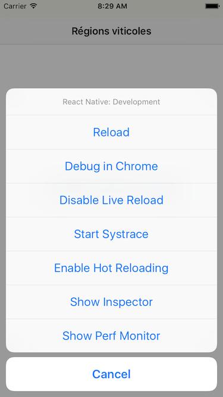
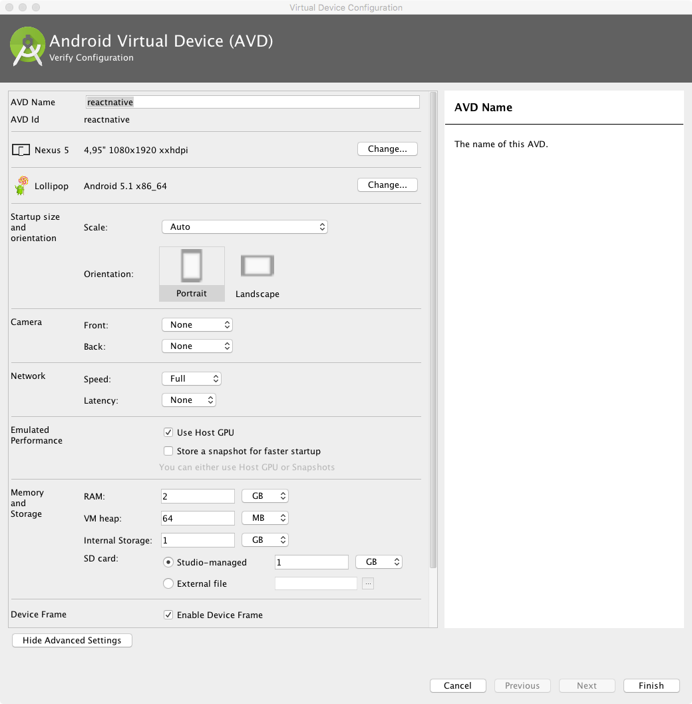
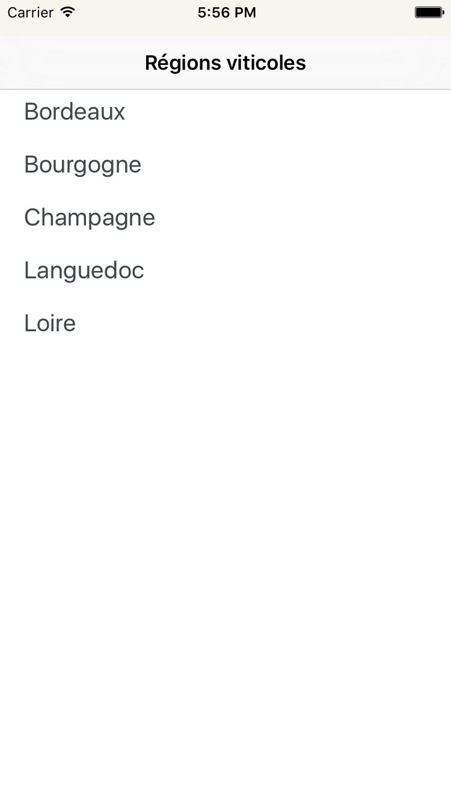
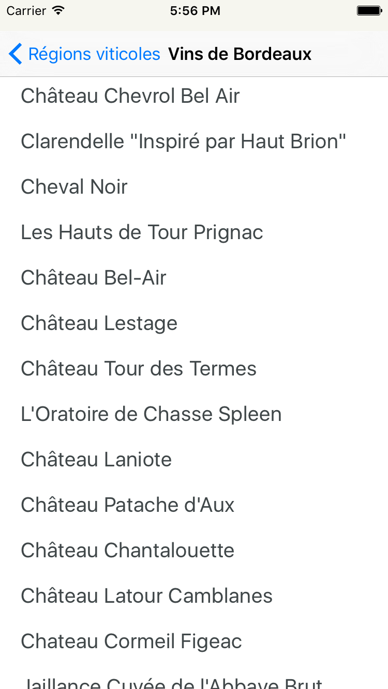
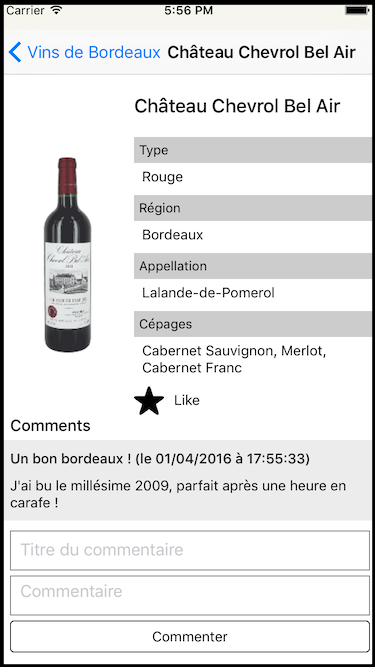
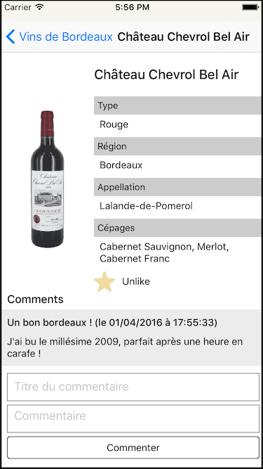
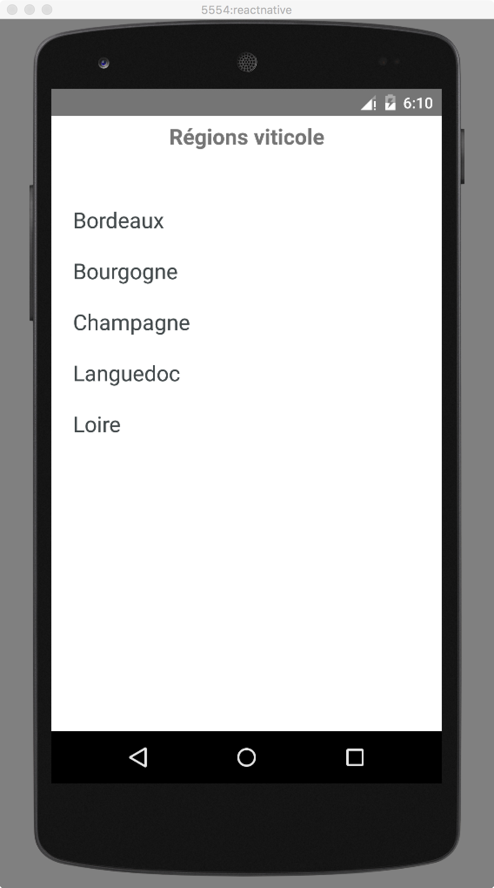
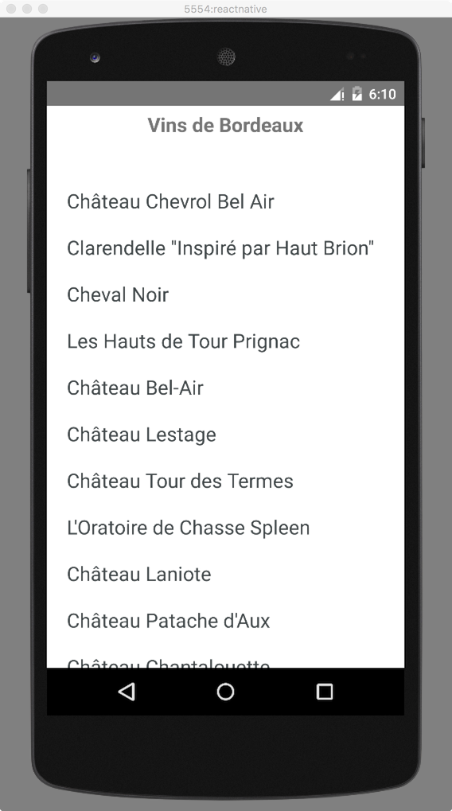
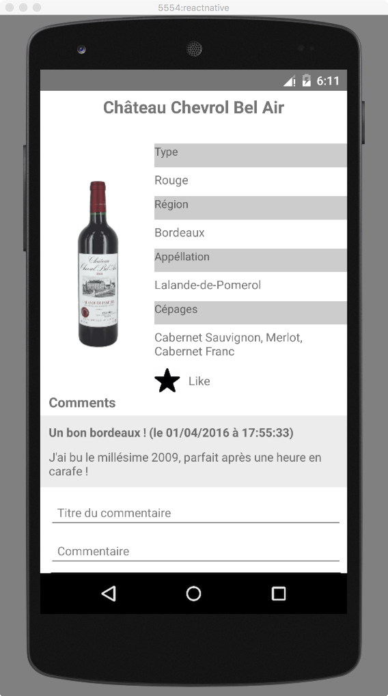
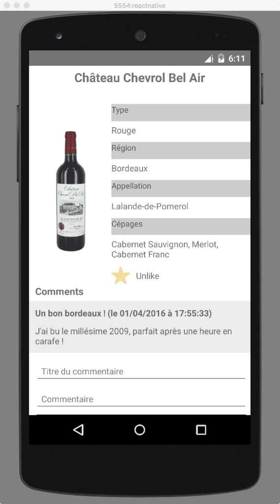

# Step 8 : `react-native`

## Pré-requis

Le code disponible dans cette étape à une application [`react-native`](https://facebook.github.io/react-native) avec un minimum de code pour commencer dans de bonnes conditions.

Pour lancer l'application, exécutez la commande `npm start` (après avoir fait un `npm install`), n'oubliez pas de lancer l'API (lancez la commande `npm start` dans le dossier `api`).

## Objectif

Ecrire l'application de gestion de vin pour mobile en [`react-native`](https://facebook.github.io/react-native)

## Mise en place de l'environnement

Pour cette partie, vous aurez besoin d'installer quelques petites choses en plus par rapport à la version web.


Commencez par installer le client `react-native` de manière globale (`-g`)sur votre système.

```
npm install -g react-native-cli
```

Sous Linux et Mac OS, vous aurez surement besoin d'installer `watchman`, suivez les [instructions d'installation](https://facebook.github.io/watchman/docs/install.html).

### iOS

Commencez par vous rendre [sur le Mac App Store](https://itunes.apple.com/fr/app/xcode/id497799835?mt=12) et installez Xcode.

Une fois Xcode installé, ouvrez le projet `step-8/ios/wines.xcodeproject` dans `xcode` et lancez le projet dans un émulateur (iPhone 6). Faites `Cmd+D` et activez le `Hot reload` pour recharger l'application au fur et à mesure des changements dans le code.



### Android

Commencez par installer un [JDK8](http://www.oracle.com/technetwork/java/javase/downloads/jdk8-downloads-2133151.html), [Gradle](http://gradle.org/gradle-download/), et [Android Studio](http://developer.android.com/sdk/index.html)

Vous pouvez ensuite suivre [cette documentation](https://facebook.github.io/react-native/docs/android-setup.html#content) sur le site de `react-native`.

En ce qui concerne l'émulateur, si vous n'avez rien d'existant pour le moment (émulateur, Genymotion), vous pouvez suivre [cette partie de la documentation](https://facebook.github.io/react-native/docs/android-setup.html#alternative-create-a-stock-google-emulator) en utilisant le nom d'émulateur `reactnative` et en utilisant `1Go` de mémoire interne et `1Go` de mémoire externe et `2Go` de RAM (Android Lolipop, API 22, 1Go de stockage interne, 1Go de stockage SD, 2Go de RAM, Nexus 5, nommé `reactnative`)



Ouvrez le projet `step-8/android` dans `Android Studio`, lancez l'émulateur (manuellement ou avec la commande `npm start run-adv`), déployez l'application (avec la commande `npm start install-android`) et lancez la depuis le menu application du device Android. Faites `Ctrl+F2` et activez le `Hot reload` pour recharger l'application au fur et à mesure des changements dans le code.

## Passage de l'application en `react-native`

Un des avantage de `react-native` est de pouvoir faire de la réutilisation de code, nous allons donc pouvoir récupérer une bonne partie du code de notre application.

Voici ce que devrait donner l'application une fois finie

### iOS



*La page de sélection de la région*



*La page de sélection du vin*



*La page de description du vin avec un commentaire*



*La page de description du vin avec un favori*

### Android



*La page de sélection de la région*



*La page de sélection du vin*



*La page de description du vin avec un commentaire*



*La page de description du vin avec un favori*

## Mise en place de l'environnement

Cette partie décrit comment créer le projet `react-native` à titre informatif car ce dernier a déjà été créé dans l'étape 8 avec quelques additions pour pouvoir se lancer plus rapidement. Pour pouvez cependant dérouler le scénario dans un dossier à part pour maitriser le procéssus.

Commencez par installer `watchman` et `react-native-cli`

puis créez votre projet à l'endroit désiré

```
react-native init wines
```

maintenant il ne reste plus qu'à lancer l'application dans un émulateur.

### iOS

Ouvrez le projet `wines/ios/wines.xcodeproject` dans `xcode` et lancez le projet dans un émulateur (iPhone 6). Faites `Cmd+D` et activez le `Hot reload` pour recharger l'application au fur et à mesure des changements dans le code. Essayez de modifier le contenu de `wines/index.ios.js` pour voir vos modifications s'appliquer directement.

### Android

Ouvrez le projet `wines/android` dans `Android Studio`, lancez l'émulateur (manuellement ou avec la commande `npm start run-adv`), déployez l'application (avec la commande `npm start install-android`) et lancez la depuis le menu application du device Android. Faites `Ctrl+F2` et activez le `Hot reload` pour recharger l'application au fur et à mesure des changements dans le code.

## Let's code !!!

L'application mobile proposée a pour point d'entré `index.ios.js` ou `index.android.js`, suivant la plateforme d'exécution. Ce fichier est un simple lanceur vers votre véritable application se trouvant dans `src/app.js`.

Dans ce fichier vous allez pouvoir instancier votre composant WineApp tout en lui fournissant un store `redux` (via le composant `<Provider />`). On repart sur les même base que l'application Web, la partie Redux reste sensiblement la même et est donc déjà founie dans le dossier de l'étape.

```javascript
import React from 'react-native';

import { Provider } from 'react-redux';
import { createStore, applyMiddleware } from 'redux';
import thunk from 'redux-thunk';
import { app } from './reducers';

import { WineApp } from './components/wine-app';

const store = createStore(app, applyMiddleware(thunk));

export const App = React.createClass({
  render() {
    return (
      <Provider store={store}>
        <WineApp />
      </Provider>
    );
  }
});
```

N'oubliez pas pour le reste de l'application, le fichier `src/components/style.js` contient tous les styles dont vous pouvez avoir besoin pour votre application.

*Attention : si vous utilisez développez une application Android, allez modifier le fichier `src/actions/index.js` et changez `export const apiHost = '127.0.0.1';` par votre adresse IP afin que l'émulateur Android puisse atteindre le serveur de l'API*

### Routage

Votre application mobile, à l'instar la version web, va avoir besoin de router son utilisateur à travers divers écrans, cependant ici, pas besoin de se soucier de l'URL, des boutons du navigateur, etc ...

Cependant, le routage entre écran sous iOS et Android est complètement différent, nous allons donc utiliser deux API différentes suivant l'OS désiré, c'est pour celà que nous allons avoir deux fichiers `src/components/wine-app.ios.js` et `src/components/wine-app.android.js`.

#### iOS

`react-native` founit une API de navigation liée à iOS, qui utilise directement des APIs Objective-C. Le composant en question s'appelle [`<NavigatorIOS />`](https://facebook.github.io/react-native/docs/navigatorios.html#navigatorios) et permet de spécifier un style, ainsi qu'une route de départ, votre écran d'accueil. Chaque composant rendu par `<NavigatorIOS />` se verra assigné une propriété `navigator` possédant une méthode `push` pour naviguer vers l'écran suivant.

Chaque `route` passée au `navigator` est en fait un object constitué d'un titre, d'un composant et éventuellement d'une liste de propriétés

```javascript
this.props.push({
  title: 'Ma page 1',
  component: Page1,
  passProps: {
    itemsToDisplay: [ ... ]
  }
});
```

Par exemple dans notre cas, l'instanciation de `<NavigatorIOS />` s'écrit de la façon suivante :

```javascript
import React, { NavigatorIOS } from 'react-native';
import { Regions } from './regions';
import { styles } from './style';

export const WineApp = React.createClass({
  render() {
    return (
      <NavigatorIOS
          style={styles.navigatorios}
          initialRoute={{
              title: 'Régions viticoles',
              component: Regions
          }} />
    );
  }
});
```

#### Android

Le cas d'Android est un peu plus compliqué, puisqu'il n'y a pas d'API dédiée à la navigation. Nous allons donc nous appuyer sur une API purement Javascript [`<Navigator />`](https://facebook.github.io/react-native/docs/navigator.html#navigator) founie par `react-native`. De plus, pour ne pas à avoir trop de code spécifique à écrire, nous allons faire en sorte que l'API de navigation fournie pour chaque `page` soit la même que pour iOS, à savoir une propriété `navigator` possédant une méthode `push` pour naviguer vers l'écran suivant. Chaque `route` passée au `navigator` est en fait un object constitué d'un titre, d'un composant et éventuellement d'une liste de propriétés

```javascript
this.props.push({
  title: 'Ma page 1',
  component: Page1,
  passProps: {
    itemsToDisplay: [ ... ]
  }
});
```

Nous utiliserons donc l'API `<Navigator />` de la façon suivante :

```javascript
import React, { Navigator, BackAndroid, Text, View } from 'react-native';
import { Regions } from './regions';
import { styles } from './style';

export const WineApp = React.createClass({
  componentWillUnmount() {
    // ici on décable le bouton back android
    BackAndroid.removeEventListener('hardwareBackPress', this.handleBackButton);
  },

  handleBackButton() {
    // si on ne se trouve pas sur l'écran d'accueil
    if (!this.isOnMainScreen) {
      // on demande au navigator de faire un retour arrière
      this.navigator.pop();
      return true;
    }
    return false;
  },

  renderScene(route, nav) {
    if (!this.navigator) {
      this.navigator = nav;
      // ici on cable le bouton back android pour faire un retour arrière
      BackAndroid.addEventListener('hardwareBackPress', this.handleBackButton);
    }
    // on récupère le composant sur la route
    const Component = route.component;
    // on récupère les propriétés sur la route
    const props = route.passProps || {};
    // on récupère le titre de la route
    const title = route.title;
    // on regarde si on est sur l'écran d'accueil
    if (Component === Regions) {
      this.isOnMainScreen = true;
    } else {
      this.isOnMainScreen = false;
    }
    // on retourne notre vue qui est composée d'un titre et du composant avec les propriétés
    // le title et l'API de navigation
    return (
      <View>
          <View style={{ flex: 1, alignItems: 'center', justifyContent: 'center', marginTop: 5 }}>
              <Text style={{ flex: 1, textAlign: 'center', fontSize: 20, fontWeight: '500' }}>{title}</Text>
          </View>
          <Component {...props}
              navigator={nav}
              title={title} />
      </View>
    );
  },

  // configuration de la scène d'un point de vue animation
  // ici chaque nouvel écran arrivera par le bas
  configureScene(route) {
    if (route.sceneConfig) {
      return route.sceneConfig;
    }
    return Navigator.SceneConfigs.FloatFromBottom;
  },

  // ici instanciation du navigateur avec son style, sa configuration de scene et
  // sa route initiale
  render() {
    return (
        <Navigator
            style={styles.navigatorandroid}
            initialRoute={{ title: 'Régions viticoles', component: Regions }}
            renderScene={this.renderScene}
            configureScene={this.configureScene} />
    );
  }
});
```

### Listes

Maintenant, vous allez avoir a créer deux listes permettant d'afficher les régions et les vins pour chaque région. Pour celà nous allons utiliser l'API [`<ListView />`](https://facebook.github.io/react-native/docs/listview.html#listview) de `react-native`.

Cette API fournie un modèle de programmation pour afficher des listes cliquables. Pour implémenter une liste d'item, nous aurons besoin de deux composants, la liste et les cellules à afficher par la liste. Une cellule est une composant très simple comme par exemple :

```javascript
import React, { PropTypes, Text, TouchableHighlight, View } from 'react-native';
import { styles } from './style';

export const ItemCell = React.createClass({
  propTypes: {
    onSelect: PropTypes.func,
    item: PropTypes.object,
  },
  render() {
    return (
      <TouchableHighlight onPress={this.props.onSelect}>
        <View style={styles.container}>
          <Text style={styles.cellTitle}>
            {this.props.item.name}
          </Text>
        </View>
      </TouchableHighlight>
    );
  }
});
```

La liste quand a elle doit utiliser notre `store` `redux` et peut se coder de la façon suivante. Vous noterez l'utilisation de `componentDidUpdate` pour détecter les changements de valeur du store et mettre à jour la liste.

```javascript
import React, { PropTypes, ListView } from 'react-native';

import { connect } from 'react-redux';
import { fetchItems } from '../actions';
import { ItemCell } from './region-cell';
import { MyComponent } from './wine-list';
import { styles } from './style';

const mapStateToProps = (state) => {
  return {
    items: state.items
  };
}

export const ItemList = connect(mapStateToProps)(React.createClass({

  propTypes: {
    dispatch: PropTypes.func.isRequired,
    navigator: PropTypes.object,
    items: PropTypes.arrayOf(PropTypes.object)
  },

  getInitialState() {
    return {
      // ici on utilise une datasource spécifique pour la ListView.
      dataSource: new ListView.DataSource({ rowHasChanged: (row1, row2) => row1 !== row2 })
    };
  },

  // ici on lance l'appel HTTP pour récupérer les données à afficher
  componentDidMount() {
    this.props.dispatch(fetchItems());
  },

  // logique permettant de détecter les changements de valeurs de items au niveau
  // du store redux et de mettre à jour la datasource le cas échéant.
  componentDidUpdate(prevProps) {
    if (prevProps.items !== this.props.items) {
      this.setState({
        dataSource: this.state.dataSource.cloneWithRows(this.props.items)
      });
    }
  },

  // cette fonction gère les évènement de type `selection` sur une cellule de
  // la liste et déclenche la navigation vers la prochaine vue.
  selectItem(item) {
    this.props.navigator.push({
      title: `Showing ${item.name}`,
      component: MyComponent,
      passProps: {
        item
      }
    });
  },

  // cette fonction retourne une vue pour chaque cellule de la list
  renderItem(item) {
    return(
      <ItemCell onSelect={() => this.selectItem(item)} item={item} />
    );
  },

  // ici on rend une ListView avec une source de données et une fonction pour
  // rendrer chaque cellule de la liste
  render() {
    return (
      <ListView style={styles.listView}
          dataSource={this.state.dataSource}
          renderRow={this.renderItem} />
    );
  }
}));
```

Dans notre application nous avons donc besoin de deux listes. Il serait bien que chaque liste affiche une page de chargement durant l'appel HTTP (voir le composant `<Loading />`).

La liste de sélection des vins pourrait également afficher une miniature de la photo de la bouteille de vin en plus du nom du vin.

### Fiche de détail d'un vin

// TODO

### Commentaires

// TODO

## A vous de jouer !

Surtout ne restez pas bloqués ! N'hésitez pas à demander de l'aide aux organisateurs du workshop ou bien à jetter un oeil au code disponible dans la [version corrigée](../step-8-done) ;-)

## Bonus

Vous pouvez rajouter le compteur de stats globales présent dans la version web (qui a volontairement été oublié) à la version mobile. A vous de fouiller [la documentation `react-native`](https://facebook.github.io/react-native/docs/getting-started.html) afin de trouver un belle façon d'intégrer cette nouvelle fonctionnalité.


## Prochaine étape

Une fois cette étape terminée, vous pouvez aller consulter la [version corrigée](../step-8-done)
